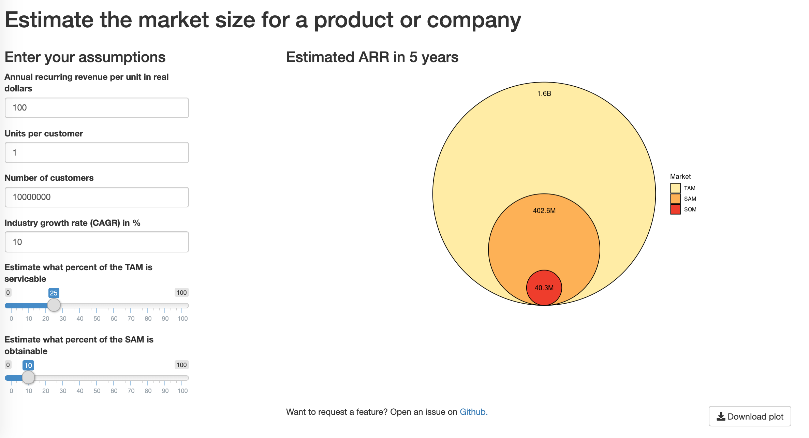

# Market Size App
This is a R Web App written with Shiny to interactively display a company's market size in an easy-to-use dashboard.  

The dashboard is available at: https://katiesaund.shinyapps.io/market_size_app/  

Users can estimate the market size of a product, company or industry using a bottom up approach. The dashboard dynamically generates the plot with the relative sizes of the total available market (TAM), serviceable available market (SAM), and serviceable obtainable market (SOM). Users can download a `.png` of the plot.    

This dashboard was created to streamline market sizing efforts I undertake as a member of the University of Michigan's [Wolverine Venture Fund](http://zli.umich.edu/wolverine-venture-fund). 

Static image of the dashboard: 
